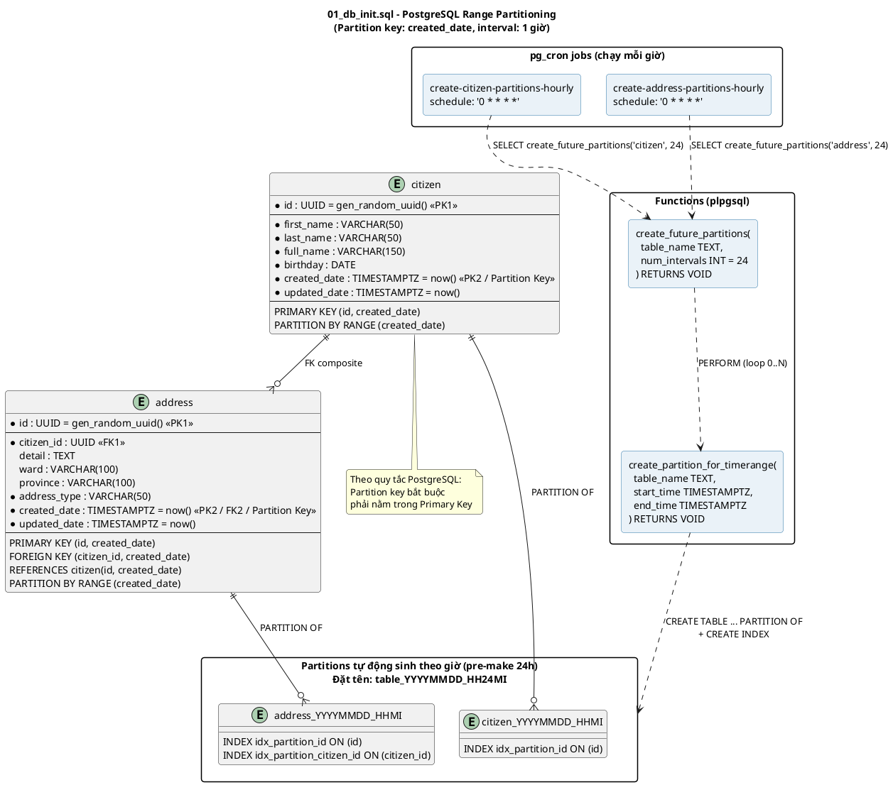

# Document for: vietnamese-citizen-service

## Process

### 1. Requirements

| Functional Requirements | Non Functional Requirements |
|-------------------------|-----------------------------|
| Fake Citizen (Job)      | Strict Consistency (ACID)   |
| Create Citizen (POST API) | Idempotency                 |
| Get Citizen (GET API)   | Scalability                 |
|                         | High Availability           |
|                         | Low Latency                 |

### 2. Data Model

### 3. API Design
### 4. High Level Design
### 5. Deep Dive 1: The Immutable Ledger
### 6. Deep Dive 2: Cross-Shard Transactions
### 7. Deep Dive 3: Asynchronous Settlement & Reconciliation
### 8. Complete Architecture
### 9. Additional Discussion Points
